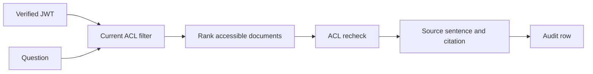

# Permission-Aware Multi-Tenant RAG

A runnable prototype of retrieval with tenant, role, user, and classification checks. The sample documents describe two fictional companies. Answers quote one accessible source sentence and cite its document ID.



## Run locally

From this directory:

```bash
uv sync --extra dev
export RAG_JWT_SECRET='replace-this-with-a-random-secret-of-at-least-32-bytes'
uv run uvicorn secure_rag.api:build_app --factory --reload
```

The API exposes `POST /answer` with a JSON body containing only `question`. It requires an HS256 Bearer JWT with `sub`, `tenant_id`, `roles`, `clearance`, `iss`, `aud`, and `exp` claims. Defaults are issuer `secure-rag-local` and audience `secure-rag-api`. Use a locally generated test token; do not commit signing secrets.

```bash
uv run pytest -q
uv run python evaluation/adversarial.py
```

## How access is enforced

A chunk is eligible when its tenant matches, its classification is at or below the caller's clearance, and the caller has a user or role grant. The local search checks the current in-memory ACL before ranking and checks it again before returning evidence. Grants and revocations therefore take effect without re-indexing. The extractive answer selects a source sentence with substantive question terms and abstains when it finds none. Audit rows include request ID, UTC timestamp, user, tenant, query, model ID, and returned or rejected chunk IDs. Rejected IDs cover only candidates that reached the final ACL check; documents excluded before ranking are not listed.

`qdrant_payload_filter` illustrates a tenant, classification, and grant filter for Qdrant payloads. The demo uses an in-memory scan and does not connect to Qdrant. A database-backed version would need to update payloads when grants change and retain the current-ACL recheck for revocations.

Document IDs are scoped by tenant, so both sample tenants can use local IDs such as `leave` and `pay`. Citations show the scoped form, such as `acme:leave`.

## Adversarial evaluation

The evaluation sends 12 questions for each of 12 tenant, role, and clearance combinations through the HTTP API. It also checks four fixed allowed cases, verifies access before revocation, and repeats 12 questions after revoking an Acme grant. The fixed fictional corpus produced **161 HTTP requests, zero unauthorized citations, zero false denials across five positive probes, and zero answer-format failures**. Run `uv run python evaluation/adversarial.py` to reproduce it. The positive probes are deliberately few; this is not a production security or answer-quality claim.

## Limits

The hash embedder and extractive answer function are deterministic local fixtures. This repository does not measure retrieval quality on a benchmark, use a language model, persist ACLs, or provide production authentication or audit storage. The audit log has no retention limit or query redaction, and the API has no rate limiter. The API loads fictional JSONL data at startup and is intended for local demonstration and access-control tests.

Related projects: [answer caching and model routing](https://github.com/Sankew/rag-cache-model-routing) and [GraphRAG evidence retrieval](https://github.com/Sankew/graph-rag-evidence-retrieval).
